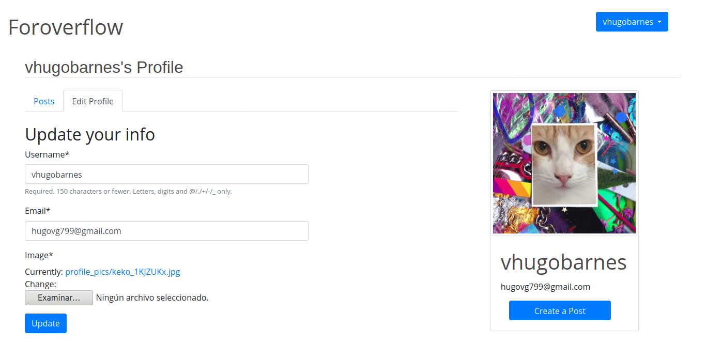

# Foroverflow
The new way to ask your questions   

This is my first Django project alone without a guide tutorial.   

The site is a simple forum for asking `simple` cuestions. At the moment the posts does not have a MarkDown style to attach code like `print("hello")` but in the future I will add this feature to improve the posts.

As I say, this project is made in Django using simple views (not ClassBasedViews), dynamic url's and basic models.

For the database I use PostgreSQL.

## List of Python packages needed to run the project:   

```

asgiref (3.2.7)
astroid (2.4.1)
Django (3.0.6)
django-crispy-forms (1.9.1)
isort (4.3.21)
lazy-object-proxy (1.4.3)
mccabe (0.6.1)
Pillow (7.1.2)
pip (9.0.1)
pkg-resources (0.0.0)
psycopg2-binary (2.8.5)
pylint (2.5.2)
pylint-django (2.0.15)
pylint-plugin-utils (0.6)
pytz (2020.1)
setuptools (39.0.1)
six (1.14.0)
sqlparse (0.3.1)
toml (0.10.1)
wrapt (1.12.1)


```

## Screenshots

- **Register view**   
   

- **Login View**   


- **Logout View**   


- **Home View**   


- **Forum View**   


- **Post Detail View**   


- **Create Post View**   


- **Delete Post View**   


- **Delete Post Successful View**   


- **Edit Post**   


- **Profile Posts View**   


- **Profile Edit View**   


